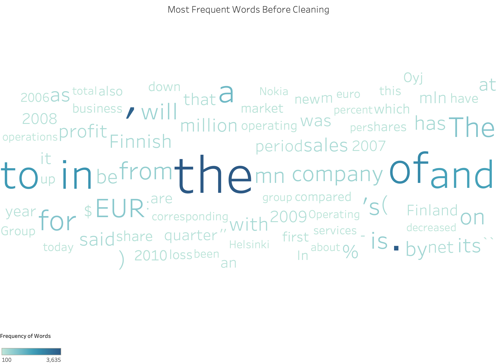

# Analyzing Stock Sentiment using Roberta

## Brian Huang, Koosha Jadbabaei, Vineet Tallavajhalla

## Introduction

<p> In today’s age of growing information, the intersection between data science and finance has grown tremendously. In this report, we aim to find a competitive advantage in the market using sentiment analysis on a data set of sentences that resembles tweets (sentences with a max of two hundred eighty characters). Prior to delving into sentiment analysis, we first cleaned the data including replacement and removing stop words (during EDA). We determined later that cleaning the data ultimately hurt the results for most models, so much of the cleaning conducted was ultimately reverted to optimize performance. To determine sentiment, we tried various approaches including more naive solutions such as NLTK vader and TFIDF with simple classification algorithms. From these models we received subpar results which inclined us to look towards more complex solutions. We found that using Hugging Face’s roBERTa based sentiment analyzer gave the best results on the given data set primarily optimizing for accuracy. </p>

### Contents
- [Data Cleaning](###Data-Cleaning)
- [Data Visualization](###Data-Visualization)
- [Model and Analysis](###Data-Modeling-and-Analysis)
- [Conclusions](###Conclusions)

### Data Cleaning
We started cleaning by looking for the words that occured most in our dataset. To do this, we iterated through each of the sentences and added the values to a counter. Right away, we see issues with the words that are occuring the most frequently. Many of these words are either stop words, puncutation, or abbreviations of words like 'million' (which in this case is abbreviated to `mln` or `mn`).
``` Python
words_before_cleaning = [word for lst in train['Sentence'] for word in lst.split()]
```


In order to deal with the noise in our sentences, we removed all stop words, punctuation, and lemmatized (a process that allows us to turn words such as believing and believed into their stems (believe) depending on the context. Lemmeatizing is better than stemming, which just cuts off the stem) our sentences. We also replaced a lot of the abbreviations, using Pandas' native replace command. 

```Python

train['Sentence'] = train['Sentence'].str.replace(' \'s',"")
train['Sentence'] = train['Sentence'].str.replace('mln', ' million')
train['Sentence'] = train['Sentence'].str.replace('mn', ' million')
train['Sentence'] = train['Sentence'].str.replace(' mln', ' million')
train['Sentence'] = train['Sentence'].str.replace(' mn', ' million')
train['Sentence'] = train['Sentence'].str.replace(' million', ' million')
train['Sentence'] = train['Sentence'].str.replace('Oyj', ' oyj ')
train['Sentence'] = train['Sentence'].str.replace('oyj', ' oyj ')
train['Sentence'] = train['Sentence'].str.replace(' oyj', ' oyj ')
train['Sentence'] = train['Sentence'].str.replace('oyj ', ' oyj ')
train['Sentence'] = train['Sentence'].str.replace(' oyj ', ' Nokia')

from nltk.corpus import stopwords
punc = '''!()-[]{};:'"\,<>./?@#%^&*_~'''
lemmatizer = WordNetLemmatizer()

def removeStop(sentence):
    words = []
    for word in sentence.split():
        if word.lower() not in stopwords.words('english') and word.lower() not in punc:
            words.append(lemmatizer.lemmatize(word))
    return words

train['Cleaned Text'] = train['Sentence'].apply(removeStop)
```

### Data Visualization

### Data Modeling and Analysis 

### Conclusions

<p>From conducting sentiment analysis on the dataset with various approaches, we found that the roBERTa based sentiment analyzer did the best at effectively predicting the sentiment of sentences about financial markets. Although there may be inaccuracies in the prediction, since there are various complexities in text data including sarcasm and hidden meaning, we found our model does a fairly good job in capturing most of these complexities and determines sentiment effectively. 

There are some limitations within our model that could be improved upon in future works. For example, the roBERTa model is a pretrained model on around seventy million tweets which makes the tuning of the model extremely limited. If given more time, an alternative approach could be taken such as a deep learning solution which we tune (although this computationally would be intensive and require a significant amount of computation). Furthermore, another approach that could be taken is further cleaning the text data given and continuously run roBERTa on these new cleaned data to see if the performance improves. Due to the functional limitation of roBERTa, however, the approach given in this report is primarily optimized and a completely alternative approach would need to be taken to make significant improvements. </p>
