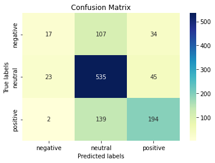

# Hey Roberta, how do you feel about this stock?
## Financial Sentiment Analysis with roBERTa: DataHacks 2022 Advanced Track

## Brian Huang, Koosha Jadbabaei, Vineet Tallavajhala 

### Team Name: 3 Switch

## Introduction

<p> In today’s age of growing information, the intersection between data science and finance has grown tremendously. In this report, we aim to find a competitive advantage in the market using sentiment analysis on a data set of sentences that resembles tweets (sentences with a max of two hundred eighty characters). Prior to delving into sentiment analysis, we first cleaned the data including replacement and removing stop words (during EDA). We determined later that cleaning the data ultimately hurt the results for most models, so much of the cleaning conducted was ultimately reverted to optimize performance. To determine sentiment, we tried various approaches including more naive solutions such as NLTK vader and TFIDF with simple classification algorithms. From these models we received subpar results which inclined us to look towards more complex solutions. We found that using Hugging Face’s roBERTa based sentiment analyzer gave the best results on the given data set primarily optimizing for accuracy. </p>

### Contents
- [Data Cleaning and Visualization](#Data-Cleaning-and-Visualization)
- [Model and Analysis](#Data-Modeling-and-Analysis)
- [Conclusions](#Conclusions)

### Data Cleaning and Visualization
We started cleaning by looking for the words that occured most in our dataset. To do this, we iterated through each of the sentences and added the values to a counter. Right away, we see issues with the words that are occuring the most frequently. Many of these words are either stop words, puncutation, or abbreviations of words like 'million' (which in this case is abbreviated to `mln` or `mn`).
``` Python
words_before_cleaning = [word for lst in train['Sentence'] for word in lst.split()]
```
<iframe src = "https://public.tableau.com/views/DataHacks2022-UncleanedWords_16496357213210/Sheet1?:embed=y&:display_count=no&:showVizHome=no%22" height = 1080 width = 600 ></iframe>

In order to deal with the noise in our sentences, we removed all stop words, punctuation, and lemmatized (a process that allows us to turn words such as believing and believed into their stems (believe) depending on the context. Lemmeatizing is better than stemming, which just cuts off the stem) our sentences. We also replaced a lot of the abbreviations, using Pandas' native replace command. 

```Python

train['Sentence'] = train['Sentence'].str.replace(' \'s',"")
train['Sentence'] = train['Sentence'].str.replace('mln', ' million')
train['Sentence'] = train['Sentence'].str.replace('mn', ' million')
train['Sentence'] = train['Sentence'].str.replace(' mln', ' million')
train['Sentence'] = train['Sentence'].str.replace(' mn', ' million')
train['Sentence'] = train['Sentence'].str.replace(' million', ' million')
train['Sentence'] = train['Sentence'].str.replace('Oyj', ' oyj ')
train['Sentence'] = train['Sentence'].str.replace('oyj', ' oyj ')
train['Sentence'] = train['Sentence'].str.replace(' oyj', ' oyj ')
train['Sentence'] = train['Sentence'].str.replace('oyj ', ' oyj ')
train['Sentence'] = train['Sentence'].str.replace(' oyj ', ' Nokia')

from nltk.corpus import stopwords
punc = '''!()-[]{};:'"\,<>./?@#%^&*_~'''
lemmatizer = WordNetLemmatizer()

def removeStop(sentence):
    words = []
    for word in sentence.split():
        if word.lower() not in stopwords.words('english') and word.lower() not in punc:
            words.append(lemmatizer.lemmatize(word))
    return words

train['Cleaned Text'] = train['Sentence'].apply(removeStop)
```

Doing this provides us a much cleaner dataset to work with.
<iframe src = "https://public.tableau.com/views/DataHacks2022-WordCloud/WordCloud?:embed=y&:display_count=no&:showVizHome=no%22" height = 1080 width = 600 ></iframe>

From here another important factor to consider is seeing the distribution of our sentiments. This prevents us from running into any class imbalances when we model later on.


As we can see, a majority of sentences are neutral, which is something we should be cautious about as we model.

### Data Modeling and Analysis 

To begin, we want to create a simple baseline model. VADER (Valence Aware Dictionary and Sentiment Reasoner) is a lexicon and rule-based tool for sentiment analysis. From the NLTK library, VADER provides text positivity/neutrality/negativity along with a compound score (sentiment intensity). VADER is a pretrained model, so we can simply use our entire training set for our model performance benchmark.

```Python
nltk_scores = [] # Applying VADER sentiment on each row, taking the max, and putting that into dataframe
for i in list(df["Sentence"]):
    d = sid.polarity_scores(i)
    new_d = {}
    for i in d:
        if i != "compound":
            new_d[i] = d[i]
    nltk_scores.append(max(new_d, key=new_d.get))
df["NLTK Sentiment"] = nltk_scores # New NLTK output column
df = df.replace("neu", "neutral").replace("pos", "positive").replace("neg", "negative")

def make_classification(cr):
    df = pd.DataFrame(cr)
    df.drop('support', inplace = True)
    df.drop(['accuracy'], axis = 1, inplace = True)
    return sns.heatmap(df.iloc[:-1, :].T, annot=True)
cr = classification_report(df['Sentiment'], df['NLTK Sentiment'], output_dict = True)
make_classification(cr);
```


The VADER model has an accuracy of 54% on our training set. This is not the best, but still solid seeing that this is a multi-label classification task (so a model that randomly predicts Positive, Negative, or Netural will have a 33% accuracy). In addition, the chart above shows the precision and recall for our model (for each class individually and the macro/weighted averages as well). Still, there are some interesting insights we can gain from the performance of this model by looking at a confusion matrix.

```Python 

# Using seaborn to plot confusion matrix for 3 labels
cm = confusion_matrix(list(df["Sentiment"]), list(df["NLTK Sentiment"]))
ax = plt.subplot()
sns.heatmap(cm, annot=True, fmt='g', ax=ax, cmap="YlGnBu"); 
# labels, title and ticks
ax.set_xlabel('Predicted labels');ax.set_ylabel('True labels'); 
ax.set_title('Confusion Matrix'); 
ax.xaxis.set_ticklabels(['negative', 'neutral', 'positive']); ax.yaxis.set_ticklabels(['negative', 'neutral', 'positive']);
```


Based on the confusion matrix, it can be examined that an overwhelming amount of our model's predictions are in the neutral class. To put it simply, the VADER model doesn't see much positive/negative sentiment from each of the sentences. A reason for this could be the fact that the VADER model was not trained on data similar to the provided dataset.

In a 3-label classification task, a model that outputs the same class 99% of the time, with a balanced dataset, should have an accuracy around 33%. Yet the fact that this dataset is so imbalanced (about 50% neutral), in favoring neutral predictions, this model performs pretty well. Still, we will keep an eye on this model's performance and move on to some more complicated/complex models

#### TFIDF + Simple Classification
Next, we decided to test out different simple classification models with our text data transformed by TF-IDF.

TF-IDF stands for Term Frequency-Inverse Document Frequency. It is a measure that evaluates how relevant each word is to a sentence in a collection of sentences (or documents). It is done by multiplying how many times a word appears in a document by the inverse document frequency of the word over all the documents.

In our use case, TFIDF is extremely useful in that it can transform our data, in the form of text, into a numerical vector that our machines can interpret. Using these vectors with the new text vectorization, we can apply different classification models into algorithms like Logistic Regression, Naive Bayes and Support Vector Machines to achieve great model performance and successfully determine the sentiment of a given sentence.

```Python

# Lemmatizing, removing stop wrods, and removing punctuation (data cleaning)
# Creating 

lemmatizer = WordNetLemmatizer()
def removeStopTotal(sentence):
    words = []
    punc = '''!()-[]{};:'"\,<>./?@#$%^&*_~'''
    for word in sentence.split():
        if word.lower() not in stopwords.words('english') and word.lower() not in punc:
            lemon = lemmatizer.lemmatize(word.lower())
            words.append(lemon)
    return ' '.join(words)
df["Sentence No Stop"] = df["Sentence"].apply(removeStopTotal)
df.head()

# Creating a simple train test split (75/25)
X_train,X_test,y_train, y_test = train_test_split(df["Sentence No Stop"], df["Sentiment"], test_size=0.25)

# Vectorizing our new column (without stop words)

vectorizer = TfidfVectorizer()
tf_x_train = vectorizer.fit_transform(X_train)
tf_x_test = vectorizer.transform(X_test)
```

#### Model Selection

We decided to select 5 popular data classification models and test each model on the data to see which performs better. Some of our models are simpler like Logistic Regression, while others are more complex like Radial Support Vector Classifiers.

Our idea is to loop run each model on our data and select the model with the best accuracy as our top model. With that model, we can look deeper (confusion matrix) and even look into hyparameter tuning using grid search with 5 fold validation.

```Python

# Initializing each of our models

models = [LogisticRegression(), MultinomialNB(), KNeighborsClassifier(), DecisionTreeClassifier(), LinearSVC()]

# Looping through, fitting each model on TFIDF train data, creating predictions, and analyzing accuracy

model_acc = {}
for clf in models:
    string_mod = str(clf)
    clf.fit(tf_x_train,y_train)
    y_test_pred = clf.predict(tf_x_test)
    a = accuracy_score(y_test, y_test_pred)
    model_acc[string_mod] = a
```
We recieve results of {'LogisticRegression()': 0.6806569343065694, 'MultinomialNB()': 0.6596715328467153, 'KNeighborsClassifier()': 0.593978102189781, 'DecisionTreeClassifier()': 0.5894160583941606, 'LinearSVC()': 0.6678832116788321}.

From this, it appears that logistic regression has the best accuracy at around 68%. Multinomial Naive Bayes and the SVM are also very close at around 65-66%, and KNeighbors Classifier and Decision Tree Classifier are the worst performing at around 59%. Since logistic regression performed the best, we can take a deeper look at it:

```Python

clf = LogisticRegression()
clf.fit(tf_x_train,y_train)
y_test_pred = clf.predict(tf_x_test)
cr = classification_report(y_test, y_test_pred, output_dict = True)
make_classification(cr);
```


```Python 
cm = confusion_matrix(y_test, y_test_pred)
ax = plt.subplot()
sns.heatmap(cm, annot=True, fmt='g', ax=ax, cmap="YlGnBu"); 
# labels, title and ticks
ax.set_xlabel('Predicted labels');ax.set_ylabel('True labels'); 
ax.set_title('Confusion Matrix'); 
ax.xaxis.set_ticklabels(['negative', 'neutral', 'positive']); ax.yaxis.set_ticklabels(['negative', 'neutral', 'positive']);
```



Similar to the NLTK, the logistic regression model is heavily favoring the neutral class in its predictions. This is unsurprising because we already know there is a signficant class imbalance, so it makes sense that the model will be predicting neutral more often.

From here, we could take our top 3 models (Logistic Regression, Multinomial Naive Bayes, and SVM) and hyperparameter tune each one to see if we can increase our accuracy. But before we do this, we want to try out an even more complex model using Deep Learning to see if it is necessary to hyperparameter tune these simpler models in the first place.

#### roBERTa base for Sentiment Analysis

roBERTa base for sentiment analysis is a model from HuggingFace that is "trained on ~58M tweets and finetuned for sentiment analysis with the TweetEval benchmark" (https://huggingface.co/cardiffnlp/twitter-roberta-base-sentiment). This model is extremely interesting for our use case because it is already pretrained on tweets, which closely resembles the style of the data for this project. Similar to VADER, since this is a pretrained model, we will use the whole of the training dataset as a benchmark for model performance.

```Python
# Initializing model and requests

task='sentiment'
MODEL = f"cardiffnlp/twitter-roberta-base-{task}"

tokenizer = AutoTokenizer.from_pretrained(MODEL)

# download label mapping
labels=[]
mapping_link = f"https://raw.githubusercontent.com/cardiffnlp/tweeteval/main/datasets/{task}/mapping.txt"
with urllib.request.urlopen(mapping_link) as f:
    html = f.read().decode('utf-8').split("\n")
    csvreader = csv.reader(html, delimiter='\t')
labels = [row[1] for row in csvreader if len(row) > 1]

model = AutoModelForSequenceClassification.from_pretrained(MODEL)
model.save_pretrained(MODEL)
```

```Python
def roberta_text_sentiment(text):
    """
    Given a tweet, what is the sentiment?
    """
    
    def preprocess(text):
        new_text = []
        for t in text.split(" "):
            t = '@user' if t.startswith('@') and len(t) > 1 else t
            t = 'http' if t.startswith('http') else t
            new_text.append(t)
        return " ".join(new_text)
    text = preprocess(text)
    encoded_input = tokenizer(text, return_tensors='pt')
    output = model(**encoded_input)
    scores = output[0][0].detach().numpy()
    scores = softmax(scores)

    ranking = np.argsort(scores)
    ranking = ranking[::-1]
    dictionary = {}
    for i in range(scores.shape[0]):
        l = labels[ranking[i]]
        s = scores[ranking[i]]
        dictionary[l] = np.round(float(s), 3)
    return dictionary

roberta_text_sentiment(input())
```

For example, if we were to input the sentence "We love datahacks!!!", we find values of {'negative': 0.002, 'neutral': 0.023, 'positive': 0.975} sentiment. 

From evalutating our roBERTa Model, we find that the results on the training set perform much better than the previous models attempted. From comparing the actuals to the predicted, we found that the model had an accuracy of around 75.53%. 

With an accuracy of roughly 75%, the roBERTA based sentiment model clearly outperforms the rest and will be our final model to use on the test dataset. This model also favors the neutral class as seen above but this is again intuitive because of the class imbalance as seen in other models. Again, we think this model is extremely powerful because it is trained on Tweets which we would argue closely resembles the training data. Cosequetnyl, we are extremely happy with the results as 75% is a great accuracy with regards to the fact that this is a multi-label classification task with a benchmark of 33%.

### Conclusions

<p>From conducting sentiment analysis on the dataset with various approaches, we found that the roBERTa based sentiment analyzer did the best at effectively predicting the sentiment of sentences about financial markets. Although there may be inaccuracies in the prediction, since there are various complexities in text data including sarcasm and hidden meaning, we found our model does a fairly good job in capturing most of these complexities and determines sentiment effectively. 

There are some limitations within our model that could be improved upon in future works. For example, the roBERTa model is a pretrained model on around seventy million tweets which makes the tuning of the model extremely limited. If given more time, an alternative approach could be taken such as a deep learning solution which we tune (although this computationally would be intensive and require a significant amount of computation). Furthermore, another approach that could be taken is further cleaning the text data given and continuously run roBERTa on these new cleaned data to see if the performance improves. Due to the functional limitation of roBERTa, however, the approach given in this report is primarily optimized and a completely alternative approach would need to be taken to make significant improvements. </p>
